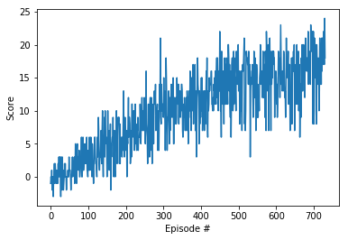

# Report

This project was solved using DQN algorithm based on this <a href = "https://deepmind.com/research/dqn/">paper </a>


## State and Action Space
The simulation contains a single agent that navigates a large environment.  At each time step, it has four actions at its disposal:
- `0` - walk forward 
- `1` - walk backward
- `2` - turn left
- `3` - turn right

The state space has `37` dimensions and contains the agent's velocity, along with the ray-based perception of objects around an agent's forward direction.  


## Learning algorithm

The agent training utilized the `dqn` function in the navigation notebook. 

It continues episodical training via a dqn agent until `n_episodes` is reached or until the environment is solved. The environment is considered solved when the average reward (over the last 100 episodes) is at least +13.

Each episode continues until `max_t = 1000` time-steps is reached or until the environment says it's done.

A reward of `+1` is provided for collecting a yellow banana, and a reward of `-1` is provided for collecting a blue banana. 

The dqn agent is contained in [`dqn_agent.py`](dqn_agent.py) 

For each time step the dqn_state acts on the current state and epsilon-greedy values. The dqn_agent utilize a replay buffer of experiences.

### DQN Hyper Parameters  

- n_episodes (int): maximum number of training epi5sodes
- max_t (int): maximum number of timesteps per episode
- eps_start (float): starting value of epsilon, for epsilon-greedy action selection
- eps_end (float): minimum value of epsilon
- eps_decay (float): multiplicative factor (per episode) for decreasing epsilon

Where

```n_episodes=2000 
max_t=1000, eps_start=1.0 
eps_end=0.01, eps_decay=0.995 
```
epislon starting value was chosen to be high 1 which means alomost all the actions selected by the agent is at random as the episodoes progresses the epislon value is annleaed to zero.

This makes sense because the 
```
BUFFER_SIZE = int(1e5)  # replay buffer size
BATCH_SIZE = 64         # minibatch size
GAMMA = 0.99            # discount factor
TAU = 1e-3              # for soft update of target parameters
LR = 5e-4               # learning rate 
UPDATE_EVERY = 5        # how often to update the network
```

 GAMMA and TAU stayed at the default values. Learning rate and update every updated by trial and error.

### Model Architure
```
----------------------------------------------------------------
        Layer (type)               Output Shape         Param #
================================================================
            Linear-1                   [37, 64]           2,432
            Linear-2                   [64, 64]           4,160
            Linear-3                    [64, 4]             260
================================================================
Total params: 6,852
Trainable params: 6,852
Non-trainable params: 0
----------------------------------------------------------------
```
The [QNetwork model](model.py) utilise 2 x 64 Fully Connected Layers with Relu activation followed by a final Fully Connected layer with the same number of units as the action size. The network has an initial dimension the same as the state size.
## Plot of Rewards



```
Episode 500    Average Score: 13.41
Episode 731    Average Score: 16.00
Environment solved in 500 episodes!    Average Score: 13.41
```

## Future Work

Even though the project has successfully achieved its goal, there is still a lot of room to improve upon in this project.

First, I think<a href = "https://arxiv.org/abs/1509.06461"> Double DQN </a>and <a href = "https://arxiv.org/abs/1511.05952"> priority experience replay buffer </a> should be implemented with this project. According to this <a href = "https://arxiv.org/abs/1509.06461"> paper </a> , the DDQN will reduce the overestimation of Q value which will lead to better policies.

Priority Experience replay buffer gives the priority to every experience tuples, this priority is given based on the TD error, more the error more priority is given that experience tuple. this has proven to increase the speed of training and better policies. For more info check out this <a href = "https://arxiv.org/abs/1511.05952"> paper </a>.

Both DDQN and Priority buffer has implemented for this project which you can find in this <a href = "https://github.com/AdithyaVenkateshMohan/Navigation-DeepRL.git">branch </a>. However, these changes haven't really given any performance improvements. this might be due to a bug or logical error so I would say this is still work in progress.

Moreover, DQN seems to produce inefficient behavior with too many movements causing instability. This could be solved using <a href = "https://arxiv.org/abs/1511.06581"> Dueling network architecture </a> for this problem.